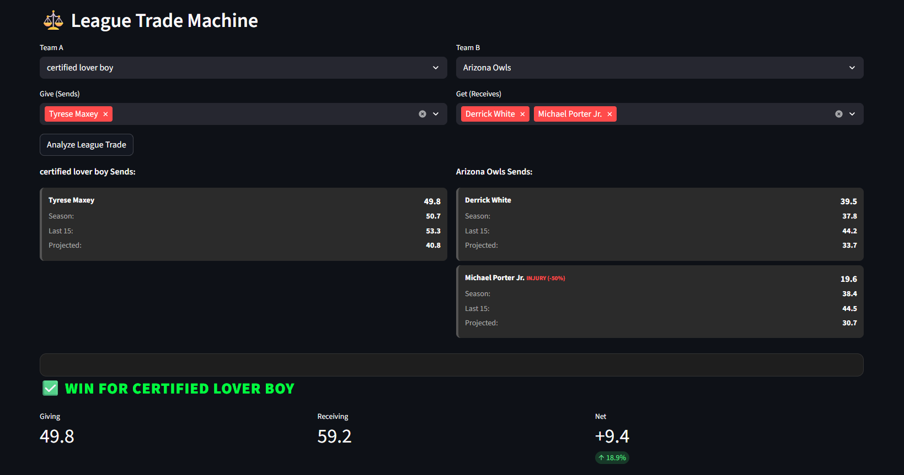
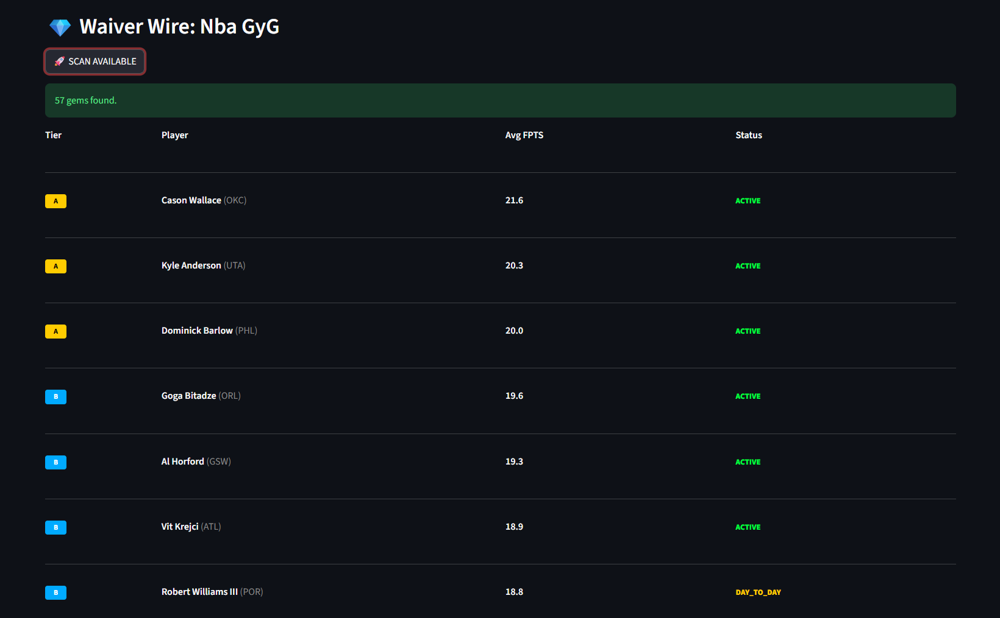
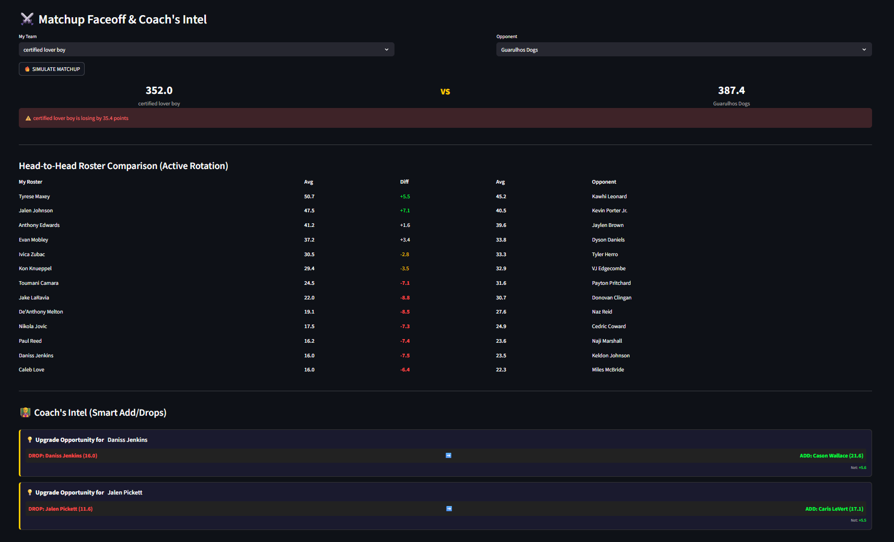

# 🧬 Apex GM: Fantasy Basketball Analytics Tool


**Apex GM** é uma ferramenta de *Data Science* desenvolvida para gerar vantagens competitivas em ligas de Fantasy Basketball da ESPN. Diferente da interface padrão, o Apex utiliza algoritmos proprietários para identificar ineficiências de mercado, prever resultados de matchups reais e automatizar a busca por trocas justas.


## 🚀 Funcionalidades (The Apex Suite)

### 🧠 Smart Trade Hunter
Não espere por ofertas. O algoritmo varre **todos os times da liga** simultaneamente para encontrar parceiros de troca ideais.
- **Package Finder:** Encontra alvos para consolidação de trocas (2 ou 3 por 1).
- **Arbitragem de Valor:** Identifica trocas matematicamente vantajosas.

### ⚔️ Matchup Faceoff & Coach's Intel
Uma simulação preditiva do confronto da semana.
- **Real Rotation:** Ignora jogadores inativos e calcula a força real do elenco.
- **Coach's Intel:** Sugere movimentos de Add/Drop comparando o "fundo do banco" com os melhores agentes livres disponíveis.

### 💎 Waiver Sniper
Encontra joias escondidas na Free Agency.
- **Filtro de Ruído:** Remove jogadores com médias infladas por jogos únicos.
- **Classificação por Tiers:** S (League Winner), A (Must Roster), B (Streamer).

### 🦅 League Opportunity Radar
Detecta "Distressed Assets" (jogadores All-Star em má fase recente) para oportunidades de *Buy Low*.

### 📢 League Buzz HQ
Gera relatórios automáticos e narrativas engajadoras para o grupo da liga (WhatsApp/Discord), incluindo "Weekly Recaps" e Vereditos de Trocas.

---

## 📸 Interface (Apex em Ação)

Abaixo estão exemplos reais da ferramenta em funcionamento, desenhada com um "Dark Mode" minimalista para focar apenas nos dados que importam.

### ⚖️ League Trade Machine (O Veredito)
*O algoritmo analisa os pacotes e emite um julgamento matemático instantâneo sobre quem venceu a troca.*


### 💎 Waiver Sniper (A Mineração)
*Varredura do mercado filtrando jogadores por potencial real (Tier S, A, B) e ignorando ruídos estatísticos.*


### ⚔️ Matchup Faceoff & Coach's Intel (Análise Tática)
*Visão dupla: acima, a simulação do confronto baseada na rotação real. Abaixo, a IA do "Coach" identifica matematicamente oportunidades de upgrade no elenco (quem soltar e quem pegar).*


---

## 🛠️ Instalação e Uso

1. **Clone o repositório:**
   ```bash
   git clone [https://github.com/SEU_USUARIO/apex-gm.git](https://github.com/SEU_USUARIO/apex-gm.git)
   cd apex-gm
